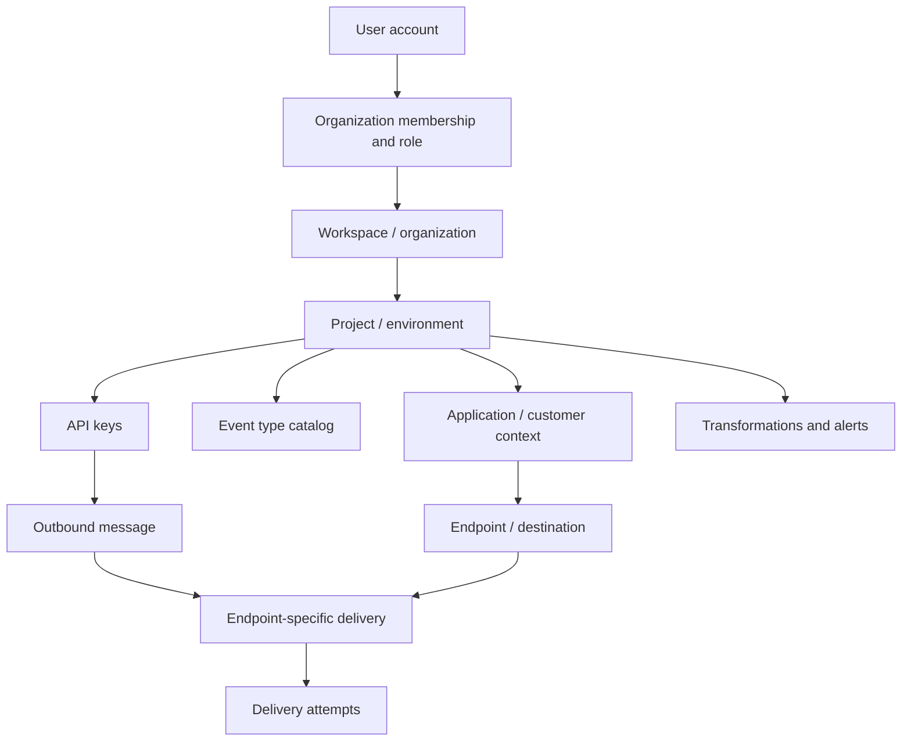
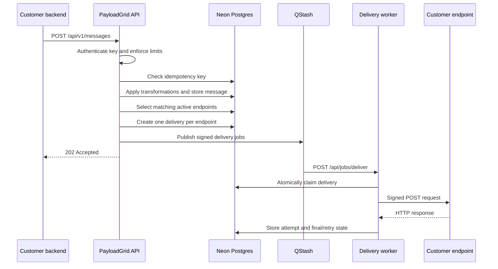
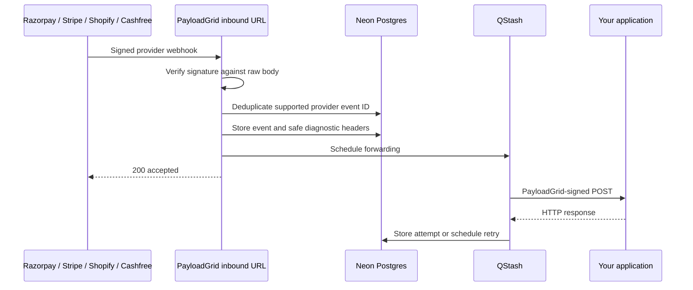
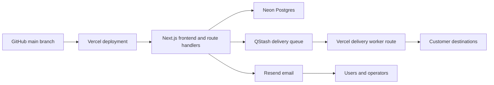

# PayloadGrid platform guide

This document explains what each part of PayloadGrid does, why it exists, how the pieces relate, and how to configure a complete test or production-style project.

It is written for:

- the PayloadGrid operator who deploys and maintains the service;
- developers integrating their backend with PayloadGrid;
- workspace owners configuring applications, destinations, and team access;
- support staff investigating a failed delivery.

## 1. What PayloadGrid does

PayloadGrid is infrastructure for receiving and sending webhooks reliably.

It supports two primary use cases:

1. **Outbound webhooks:** a customer's backend sends one event to PayloadGrid. PayloadGrid fans that event out to matching customer destinations.
2. **Inbound webhooks:** an external provider such as Razorpay, Cashfree, Stripe, or Shopify sends a callback to PayloadGrid. PayloadGrid verifies it and forwards it to the configured destination.

In both cases, PayloadGrid creates persistent delivery evidence, signs outgoing requests, records attempts, retries failures, and exposes replay and dead-letter recovery controls.

PayloadGrid is not a payment gateway and does not execute payments. It transports webhook events generated by payment systems and other applications.

## 2. Platform model



### User

A person who can sign in to the dashboard. A user can belong to multiple workspaces with a different role in each workspace.

### Workspace

The top-level customer boundary. It represents a company, team, or independent product owner. Memberships and roles belong to the workspace.

Use separate workspaces when the organizations must have separate ownership and team membership.

### Project

An isolated environment inside a workspace. API keys, applications, endpoints, event types, messages, transformations, alerts, and delivery history are project-scoped.

Recommended projects:

- `Development` for local integration work;
- `Staging` for QA and pre-production testing;
- `Production` for real customer traffic.

Never use a production API key in development or staging.

### Application

An application identifies the customer, account, store, or product context for outbound routing.

Examples:

- `Acme production account`
- `Store 5821`
- `Billing product`

One outbound message targets one application. PayloadGrid sends it to every active endpoint for that application that subscribes to the message's event type.

### Event type

A stable name describing what happened, for example:

- `order.completed`
- `invoice.payment_failed`
- `customer.subscription.updated`

Event types form the event catalog and make endpoint subscriptions predictable. Use past-tense names for completed facts and avoid changing the meaning of an existing event type.

### Endpoint

An endpoint connects an application to a destination URL. It stores:

- destination URL;
- provider type;
- inbound URL;
- outbound signing secret;
- optional encrypted provider verification secret;
- subscribed event types;
- active or paused state;
- per-endpoint delivery rate configuration.

An endpoint with no subscriptions receives every event for its application. An endpoint with subscriptions receives only matching event types.

### Message

A message is one outbound event accepted through the dashboard or public API before fan-out. Its status summarizes all endpoint-specific deliveries:

- `queued` or `processing`: at least one delivery remains active;
- `delivered`: every delivery succeeded;
- `partial`: some succeeded and some failed;
- `failed`: no destination delivery succeeded.

### Delivery

A delivery is one event sent to one endpoint. If one message matches three endpoints, PayloadGrid creates three deliveries.

### Delivery attempt

Every network attempt records its destination, HTTP status, safe response headers, response body excerpt, error, latency, and attempt number. Retries stay attached to the same delivery record.

## 3. Dashboard areas

| Area | Purpose | When it is useful |
| --- | --- | --- |
| Overview | Delivery totals, backlog, failures, latency, recent events, and revenue-at-risk signals | Daily operational review |
| Applications | Create customer or account routing contexts | Before adding endpoints or sending outbound events |
| Endpoints | Configure destinations, provider verification, subscriptions, testing, pause/resume, and deletion | Integration setup and destination maintenance |
| Messages | Send test outbound events and inspect message-level history | Initial integration and fan-out testing |
| Deliveries | Filter deliveries, inspect attempts, replay, cancel, and recover dead-letter events | Debugging and incident recovery |
| Event types | Maintain the project's event catalog | Contract management between producers and consumers |
| API keys | Generate and revoke server credentials | Authenticating backend-to-PayloadGrid requests |
| Team | Invite members and manage roles | Controlled operational access |
| Automations | Transform outbound payloads and configure failure alerts | Payload adaptation and operational notification |
| Usage | Show current project consumption and plan limits | Capacity planning |
| Workspace | Create/switch workspaces and projects, rename, transfer, leave, or delete | Tenant and environment administration |
| System health | Private project diagnostics and operator monitoring | Platform operations |
| Public status | Customer-facing component state and incident history | External transparency during incidents |

## 4. Roles and permissions

| Role | Typical permissions |
| --- | --- |
| Owner | Full workspace control, ownership transfer, members, projects, and destructive actions |
| Admin | Manage projects, members except protected owner actions, routing, and operations |
| Developer | Create and operate project resources such as endpoints, keys, messages, and automations |
| Viewer | Read-only dashboard visibility |

Platform incident controls are separate from workspace roles. They are available only when the signed-in email appears in `PAYLOADGRID_OPERATOR_EMAILS`.

## 5. Recommended first-project configuration

The following example sends an `order.completed` event from a backend to a QA destination.

### Step 1: create the workspace and projects

1. Sign up and open the dashboard.
2. Rename the default workspace to the company or product name.
3. Keep the default Production project.
4. Create a Development or Staging project for testing.
5. Confirm the correct project is active before creating any resources.

Each project has independent API keys and routing configuration.

### Step 2: create an application

Open **Applications** and create:

```text
Name: QA Store
Description: Test customer for order events
```

Copy the application UUID. The backend uses this value as `applicationId`.

### Step 3: create the event type

Open **Event types** and create:

```text
Name: order.completed
Description: An order completed successfully
```

### Step 4: add a destination endpoint

Open **Endpoints** and configure:

```text
Application: QA Store
Endpoint name: QA Order Processor
Provider: Custom
Destination URL: https://your-test-receiver.example/webhooks/orders
Subscribed event types: order.completed
```

PayloadGrid generates:

- an inbound URL such as `https://payloadgrid.com/in/ENDPOINT_UUID`;
- a signing secret beginning with `whsec_`.

Store the signing secret in the destination application's secret manager. Do not put it in frontend code.

### Step 5: generate an API key

Open **API keys** and create:

```text
Name: QA backend
```

The complete key is shown once. Store it as:

```text
PAYLOADGRID_API_KEY=pg_live_REDACTED
PAYLOADGRID_APPLICATION_ID=APPLICATION_UUID
```

PayloadGrid stores only a SHA-256 hash and key prefix. A lost key cannot be recovered; generate a replacement and revoke the old key.

### Step 6: send the first event

```bash
curl -X POST https://payloadgrid.com/api/v1/messages \
  -H "Authorization: Bearer pg_live_YOUR_KEY" \
  -H "Idempotency-Key: order_8921_completed" \
  -H "Content-Type: application/json" \
  -d '{
    "applicationId": "APPLICATION_UUID",
    "eventType": "order.completed",
    "payload": {
      "orderId": "8921",
      "status": "completed",
      "amount": 9999,
      "currency": "INR"
    }
  }'
```

A new message normally returns HTTP `202`:

```json
{
  "ok": true,
  "messageId": "MESSAGE_UUID",
  "status": "accepted",
  "duplicate": false,
  "queuedDeliveries": 1,
  "scheduledDeliveries": 1,
  "queueConfigured": true
}
```

`accepted` means the event was recorded and scheduled. It does not mean the destination has completed delivery.

### Step 7: confirm delivery

1. Open **Deliveries**.
2. Find `order.completed`.
3. Confirm the status is `Delivered` and response is HTTP `2xx`.
4. Open inspection to review request data and attempts.
5. Confirm the destination received the PayloadGrid signature headers.

## 6. Outbound event flow



Important behavior:

- API keys are project-scoped.
- `applicationId` must belong to the authenticated key's project.
- Reusing the same idempotency key in a project returns the existing message.
- Active transformations run before fan-out.
- Paused endpoints do not receive new events.
- QStash jobs use a delivery-attempt deduplication identifier.
- The database worker claim prevents the same attempt from processing concurrently.

## 7. Sending from Node.js

```js
const response = await fetch("https://payloadgrid.com/api/v1/messages", {
  method: "POST",
  headers: {
    Authorization: `Bearer ${process.env.PAYLOADGRID_API_KEY}`,
    "Idempotency-Key": "order_8921_completed",
    "Content-Type": "application/json"
  },
  body: JSON.stringify({
    applicationId: process.env.PAYLOADGRID_APPLICATION_ID,
    eventType: "order.completed",
    payload: {
      orderId: "8921",
      status: "completed"
    }
  })
});

const result = await response.json();
if (!response.ok) throw new Error(result.error || "PayloadGrid request failed");
console.log(result);
```

Use a business identifier and event version to construct the idempotency key. Do not generate a fresh random idempotency key every time a producer retries the same logical event.

## 8. Receiving and verifying PayloadGrid deliveries

PayloadGrid sends these headers:

```text
payloadgrid-id: DELIVERY_UUID
payloadgrid-timestamp: UNIX_SECONDS
payloadgrid-signature: v1,BASE64_HMAC
payloadgrid-event-type: order.completed
x-payloadgrid-delivery-mode: outbound
```

The signature input is:

```text
payloadgrid-id.payloadgrid-timestamp.rawBody
```

Node.js verification example:

```js
import crypto from "node:crypto";

export function verifyPayloadGrid(rawBody, headers, secret) {
  const id = headers.get("payloadgrid-id");
  const timestamp = headers.get("payloadgrid-timestamp");
  const supplied = headers.get("payloadgrid-signature")?.replace(/^v1,/, "");
  if (!id || !timestamp || !supplied) return false;

  const ageSeconds = Math.abs(Date.now() / 1000 - Number(timestamp));
  if (!Number.isFinite(ageSeconds) || ageSeconds > 300) return false;

  const expected = crypto
    .createHmac("sha256", secret)
    .update(`${id}.${timestamp}.${rawBody}`)
    .digest("base64");

  const actualBuffer = Buffer.from(supplied, "base64");
  const expectedBuffer = Buffer.from(expected, "base64");
  return actualBuffer.length === expectedBuffer.length &&
    crypto.timingSafeEqual(actualBuffer, expectedBuffer);
}
```

Read the raw request body before JSON parsing. Reject old timestamps and compare signatures in constant time.

## 9. Inbound provider flow

Inbound mode is useful when a third-party provider must call your application but you want verification, retry, inspection, and replay between the provider and your destination.



### Provider configuration example

1. Create an application and endpoint.
2. Choose the provider instead of `Custom`.
3. Enter the verification secret obtained from that provider.
4. Copy the endpoint's inbound URL.
5. Add that inbound URL to the provider's webhook configuration.
6. Select provider events in the provider dashboard.
7. Send the provider's test webhook.
8. Inspect the resulting inbound delivery in PayloadGrid.

Provider secret usage:

| Provider | Secret entered in PayloadGrid | Signature checked |
| --- | --- | --- |
| Razorpay | Webhook secret configured in Razorpay | `X-Razorpay-Signature` |
| Cashfree | Applicable Cashfree webhook secret | Timestamp plus raw-body signature |
| Stripe | Endpoint secret beginning with `whsec_` | `Stripe-Signature` with timestamp tolerance |
| Shopify | Shopify app client secret | `X-Shopify-Hmac-SHA256` |
| Custom | No provider verification secret | Payload is accepted as JSON and forwarded with PayloadGrid signing |

Provider verification secrets are encrypted with AES-256-GCM using `PAYLOADGRID_ENCRYPTION_KEY` and are not shown again.

## 10. Delivery recovery

Destination HTTP `2xx` responses are successful. Network errors, timeouts, and non-`2xx` responses enter retry processing.

The configured retry delays are:

```text
1 minute
5 minutes
30 minutes
2 hours
6 hours
```

The current delivery policy allows six total attempts: the initial attempt plus five retries. After the sixth unsuccessful attempt, the delivery enters `dead_letter`.

Available operations:

- **Replay:** attempt the delivery again while retaining the same delivery history.
- **Cancel:** stop a queued or retrying delivery.
- **Dead-letter:** move an active failed delivery out of automatic processing.
- **Replay dead-letter:** return a dead-letter delivery to processing through a new attempt on the same record.
- **Bulk replay:** replay a filtered set of eligible deliveries.

Replaying is safe operationally, but a destination must still use `payloadgrid-id` or its own business identifier to make processing idempotent.

## 11. Transformations and alerts

### Transformations

Transformations run on outbound messages before endpoint fan-out. They can:

- add top-level fields;
- remove top-level fields;
- rename top-level fields through the stored configuration model;
- apply to one event type or every event type.

Example:

```json
{
  "addFields": {
    "apiVersion": "2026-08-01",
    "source": "checkout"
  },
  "removeFields": ["internal_note", "debug"]
}
```

Transformations currently operate on top-level JSON object fields. They are not an arbitrary-code execution environment.

### Failure alerts

An alert rule includes:

- channel: email, Slack webhook, or custom webhook;
- destination;
- number of failures;
- rolling window in minutes;
- active or paused state.

Notification history records the attempted alert status and response. Use the test action before relying on an alert in production.

Email alerts require Resend configuration. Slack and custom webhook destinations must use safe public HTTPS destinations.

## 12. Monitoring and incidents

PayloadGrid exposes two levels of health information:

1. **Public status:** customer-facing service states and incident history at `/status`.
2. **Private system health:** project backlog, queue mode, latest delivery, and database diagnostics for authorized workspace roles.

The synthetic monitor checks:

- Public API;
- dashboard;
- inbound webhooks;
- outbound delivery;
- scheduled retries.

An incident opens after three consecutive unhealthy checks for one service and automatically resolves after two consecutive healthy checks. A platform operator can publish identified, monitoring, or resolved updates.

With hourly monitoring, detection can take up to three hours and automatic recovery confirmation can take up to two hours. Use a shorter schedule only after accounting for QStash quotas.

## 13. Environment variables

### Required application variables

| Variable | Purpose |
| --- | --- |
| `DATABASE_URL` | Neon pooled PostgreSQL connection string |
| `NEXT_PUBLIC_SITE_URL` | Canonical browser-facing URL without trailing slash |
| `PAYLOADGRID_APP_URL` | Server-facing canonical URL for links and queue callbacks |
| `PAYLOADGRID_ENCRYPTION_KEY` | Stable 32-byte key for provider-secret encryption |
| `CRON_SECRET` | Bearer secret protecting maintenance and monitoring routes |

Generate secrets:

```powershell
node -e "console.log(require('crypto').randomBytes(32).toString('base64'))"
node -e "console.log(require('crypto').randomBytes(32).toString('hex'))"
```

Use the base64 value for `PAYLOADGRID_ENCRYPTION_KEY` and the hex value for `CRON_SECRET`. Never publish either value. Changing the encryption key makes existing encrypted provider secrets unreadable.

### Durable queue

| Variable | Purpose |
| --- | --- |
| `QSTASH_TOKEN` | Publishes delivery jobs |
| `QSTASH_CURRENT_SIGNING_KEY` | Verifies current QStash worker requests |
| `QSTASH_NEXT_SIGNING_KEY` | Supports QStash key rotation |

### Email and incident operations

| Variable | Purpose |
| --- | --- |
| `RESEND_API_KEY` | Sends authentication and email alert messages |
| `PAYLOADGRID_AUTH_FROM` | Verified sender for account email |
| `PAYLOADGRID_ALERT_FROM` | Verified sender for failure and incident alerts |
| `PAYLOADGRID_OPERATOR_EMAILS` | Comma-separated platform incident operators |
| `PAYLOADGRID_INCIDENT_ALERT_TO` | Comma-separated incident email recipients |
| `PAYLOADGRID_INCIDENT_ALERT_WEBHOOK` | Optional public HTTPS incident notification target |
| `NEXT_PUBLIC_SUPPORT_EMAIL` | Public support contact |

Set production secrets directly in Vercel. Use `.env.local` only for local development and never commit it.

## 14. Deployment and infrastructure flow



### First deployment

1. Push the repository to GitHub.
2. Import it into Vercel with Root Directory set to `app` if the repository root contains that directory.
3. Create Neon and copy the pooled connection string into `DATABASE_URL`.
4. Run the complete `db/schema.sql` in Neon SQL Editor. The file is idempotent.
5. Add all required Vercel environment variables.
6. Configure QStash credentials in Vercel.
7. Deploy or redeploy after environment changes.
8. Configure protected QStash schedules.
9. Confirm `/api/health`, `/status`, signup, API acceptance, and a real destination delivery.

### QStash schedules

For low-volume free-plan testing, a quota-conscious starting point is:

```text
GET /api/cron/retry-failed   hourly
GET /api/cron/monitor        hourly
GET /api/cron/maintenance    daily
```

Each schedule must forward:

```text
Authorization: Bearer YOUR_CRON_SECRET
```

In the QStash console this may appear as:

```text
Upstash-Method: GET
Upstash-Forward-Authorization: Bearer YOUR_CRON_SECRET
```

QStash delivery jobs and retries also count against the QStash message quota. Increase schedule frequency only when the plan and operational target support it.

## 15. Current plan limits

The implemented project limits are:

| Limit | Current value |
| --- | ---: |
| Accepted outbound plus inbound events | 10,000 per project each month |
| API requests | 300 per API key each minute |
| Inbound requests | 300 per endpoint each minute |
| Endpoints | 10 per project |
| Team members | 5 per workspace |
| Inbound payload | 256 KB |
| Payload retention | 3 days |

Vercel, Neon, QStash, and Resend have separate infrastructure quotas. The application's displayed plan limits do not override provider quotas.

## 16. Security model

Implemented controls include:

- server-side tenant and project scoping;
- role-based dashboard mutations;
- one-way API-key hashing;
- scrypt password hashing;
- HTTP-only sessions;
- raw-body provider verification;
- AES-256-GCM encryption for provider secrets;
- HMAC-SHA256 destination signatures;
- timestamp support for replay protection;
- private-network destination blocking and destination revalidation;
- payload and request-rate limits;
- event and queue deduplication;
- audit history for sensitive changes;
- scheduled payload redaction.

These controls do not constitute SOC 2, ISO/IEC 27001, PCI DSS, HIPAA, or other formal certification. Do not display certification badges until the applicable independent process is complete.

## 17. Troubleshooting

### Public API returns 401

- Confirm the header is `Authorization: Bearer pg_live_...`.
- Confirm the key is not revoked.
- Confirm the key belongs to the project containing the application.

### API returns “Application not found in this project”

The application UUID and API key belong to different projects. Switch projects and create or use matching resources.

### Message is accepted with zero queued deliveries

- Confirm the application has an endpoint.
- Confirm the endpoint is active.
- Confirm the endpoint subscribes to the event type, or has no subscriptions.

### Delivery shows HTTP 404

PayloadGrid reached the destination, but the destination route did not exist. Correct the destination URL and replay the delivery.

### Delivery retries continuously

Inspect the latest HTTP status, response excerpt, timeout, or network error. Fix the destination before manually replaying. Repeated replay does not repair a destination problem.

### Inbound provider returns 401

The provider signature could not be verified. Confirm the selected provider and verification secret, and ensure the provider sends to the correct endpoint inbound URL.

### QStash schedule returns 401

The forwarded authorization must be exactly:

```text
Bearer THE_SAME_CRON_SECRET_CONFIGURED_IN_VERCEL
```

After changing a Vercel environment variable, redeploy production. Cancel old QStash retries because they retain the old request configuration.

### QStash schedule keeps retrying

QStash retries non-success responses. Correct the destination or authorization, cancel old retries, and use an appropriate retry count. Each attempt consumes quota.

### Database setup page appears

Confirm `DATABASE_URL` is present in the active Vercel environment and run the current complete `db/schema.sql` against the same Neon database.

### Status history is empty

Confirm the monitoring schedule returns HTTP `200`. The history begins after the first successful `/api/cron/monitor` run.

## 18. Production onboarding checklist

- [ ] Production workspace and project are selected.
- [ ] Production API key is stored only in the producer's secret manager.
- [ ] Every application has the expected endpoints.
- [ ] Event subscriptions are intentional.
- [ ] Provider verification is configured for inbound integrations.
- [ ] Destination applications verify PayloadGrid signatures and timestamp age.
- [ ] Destination processing is idempotent.
- [ ] QStash worker verification is configured.
- [ ] A real successful delivery is recorded.
- [ ] A controlled failure has been tested through retry and replay.
- [ ] Failure alert tests succeed.
- [ ] Team roles follow least privilege.
- [ ] Public status monitoring runs successfully.
- [ ] Data retention and customer deletion expectations are documented.
- [ ] Vercel, Neon, QStash, and email usage are monitored.

## 19. Suggested customer workflow

For each new customer or application context:

1. Create the application.
2. Agree on stable event-type names and payload contracts.
3. Add destination endpoints and subscriptions.
4. Give the destination its signing secret through a secure channel.
5. Send test events in Development or Staging.
6. Verify signatures, idempotency, and failure responses.
7. Repeat configuration in Production using separate credentials.
8. Monitor initial deliveries and tune subscriptions or endpoint rate limits.
9. Configure alerts for operational owners.

This sequence keeps tenant ownership, environment separation, routing, security, and delivery evidence explicit instead of treating a webhook as an unmanaged HTTP request.
